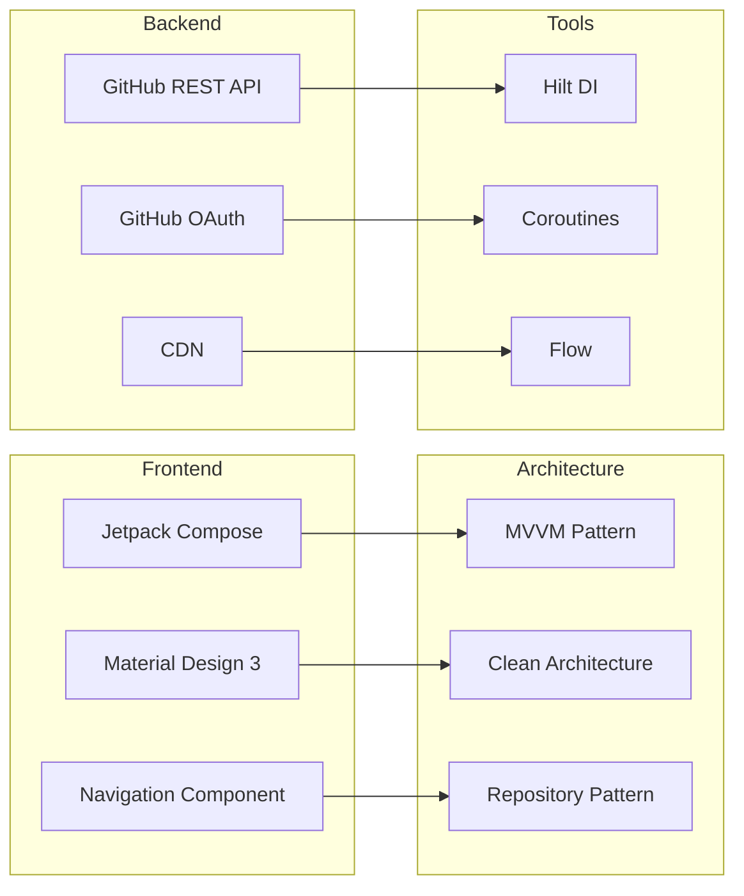
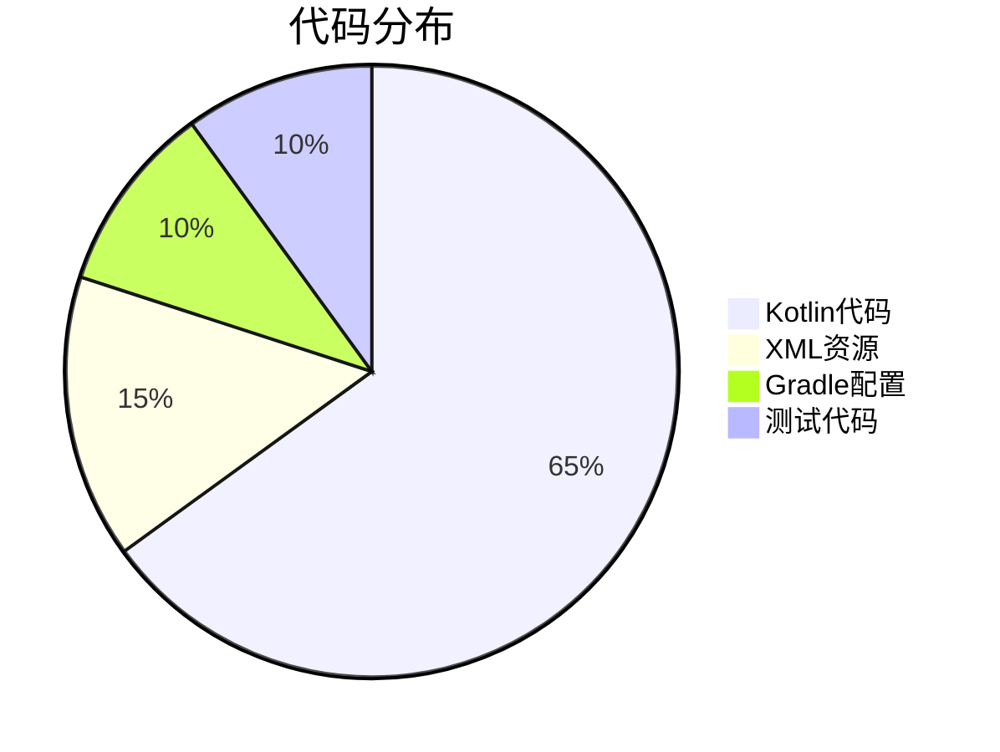
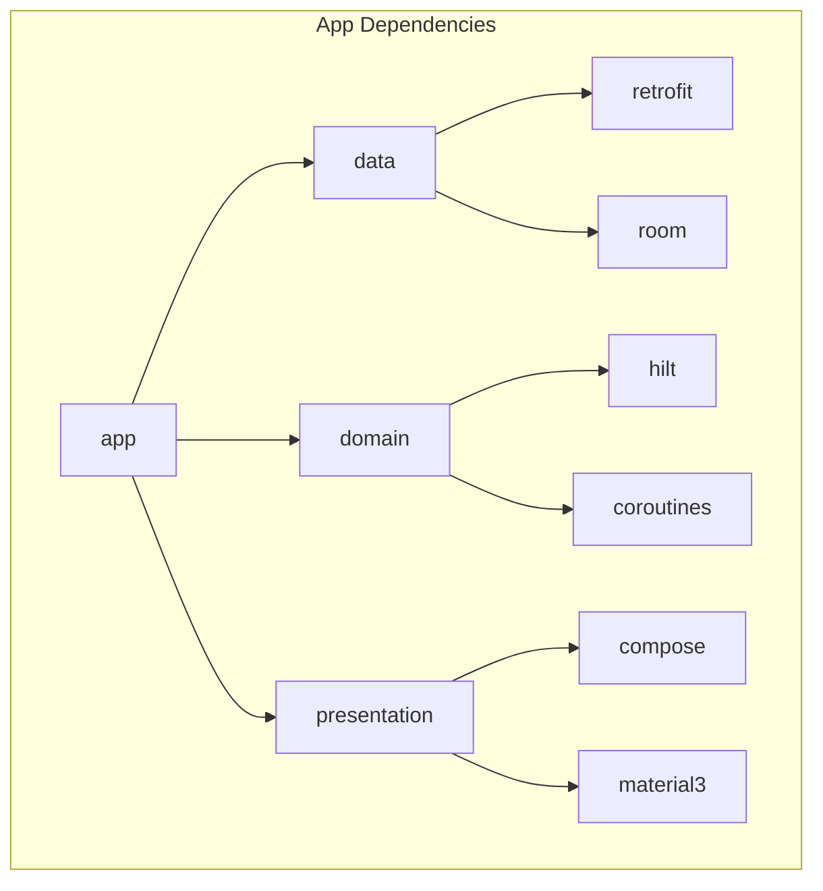

# GitHub Android App - 技术文档索引

欢迎来到GitHub Android App的技术文档中心。这里包含了项目的完整技术文档，从需求分析到架构设计，从UML图到部署方案。

## 📚 文档结构

### 🎯 核心文档
| 文档名称 | 内容概述 | 阅读建议 |
|---------|----------|----------|
| [需求文档.md](./需求文档.md) | 完整的功能需求、非功能需求、系统架构 | 项目开始前必读 |
| [项目结构.md](./project-structure.md) | 项目目录结构、代码组织方式 | 开发环境搭建时参考 |

### 🏗️ UML设计文档
| 文档名称 | 包含图表 | 技术重点 |
|---------|----------|----------|
| [uml-class-diagram.md](./uml-class-diagram.md) | 类图、接口设计、组件关系 | 面向对象设计 |
| [uml-sequence-diagram.md](./uml-sequence-diagram.md) | 时序图、交互流程、错误处理 | 系统交互逻辑 |
| [uml-component-deployment.md](./uml-component-deployment.md) | 组件图、部署图、架构图 | 系统架构设计 |

## 🚀 快速开始

### 1. 项目概览
GitHub Android App是一个现代化的Android应用程序，专为浏览GitHub仓库而设计。采用最新的Android开发技术栈：

- **架构模式**: MVVM + Clean Architecture
- **UI框架**: Jetpack Compose
- **依赖注入**: Hilt
- **网络**: Retrofit + OkHttp
- **数据库**: Room + DataStore
- **测试**: JUnit + Espresso + MockK

### 2. 技术栈

### 3. 核心功能
- 🔍 **仓库搜索**: 智能搜索GitHub仓库
- 📈 **趋势查看**: 按语言查看热门项目
- 👤 **用户资料**: 完整的用户信息和仓库展示
- 🐛 **问题管理**: 浏览和创建GitHub Issues
- 🔐 **安全认证**: OAuth 2.0安全登录
- 📱 **响应式设计**: 适配手机和平板

## 📖 阅读指南

### 新手开发者
1. 先阅读[项目结构.md](./project-structure.md)了解代码组织
2. 查看[需求文档.md](./需求文档.md)了解功能需求
3. 参考[uml-class-diagram.md](./uml-class-diagram.md)理解类设计

### 架构师/高级开发者
1. 重点阅读[uml-component-deployment.md](./uml-component-deployment.md)
2. 深入研究[uml-sequence-diagram.md](./uml-sequence-diagram.md)
3. 分析系统架构和性能优化方案

### 测试工程师
1. 查看[uml-sequence-diagram.md](./uml-sequence-diagram.md)中的测试流程
2. 参考项目结构中的测试目录组织
3. 理解测试金字塔架构

## 🔧 开发工具

### 必需工具
- **Android Studio**: Hedgehog版本或更高
- **JDK**: 11或更高版本
- **Android SDK**: API 34 (Android 14)

### 推荐插件
- Kotlin插件
- Hilt插件
- Compose插件
- GitHub Copilot（可选）

## 📊 项目统计

### 代码规模

### 模块依赖

## 🎯 下一步行动

### 开始开发
1. 克隆项目到本地
2. 配置local.properties文件
3. 设置GitHub OAuth应用
4. 运行第一个构建

### 贡献代码
1. Fork项目仓库
2. 创建功能分支
3. 编写测试用例
4. 提交Pull Request

### 报告问题
- 使用GitHub Issues报告bug
- 提供详细的复现步骤
- 包含设备信息和错误日志

## 📞 联系方式

- **项目主页**: [GitHub Repository](https://github.com/your-org/github-android-app)
- **问题跟踪**: [Issues](https://github.com/your-org/github-android-app/issues)
- **文档更新**: 欢迎提交文档改进PR

---

**最后更新**: 2024年  
**文档版本**: v1.0.0  
**维护团队**: GitHub Android App开发团队