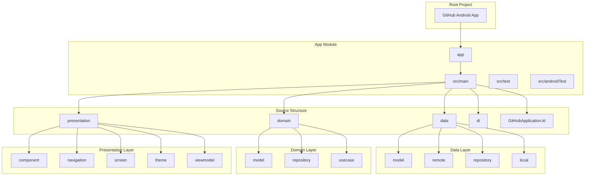
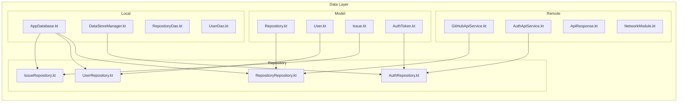
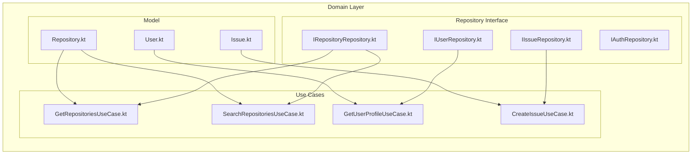
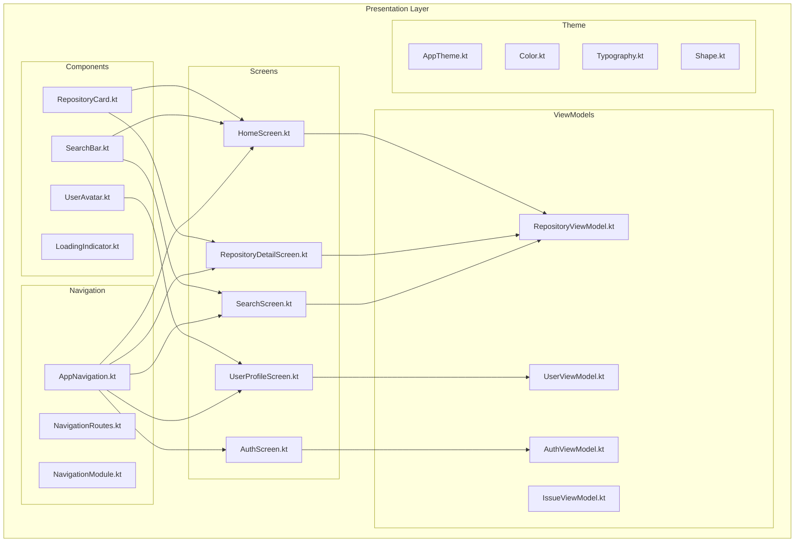
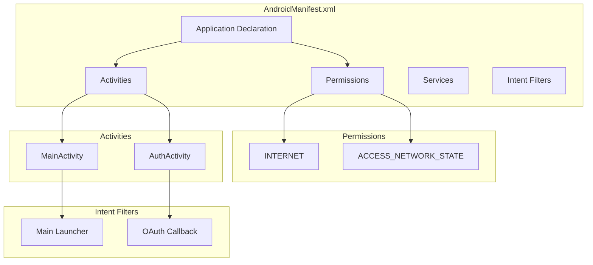
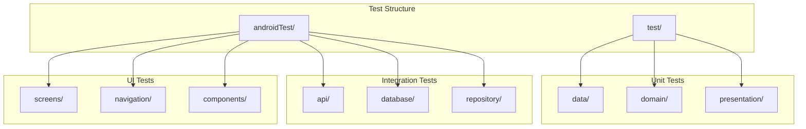
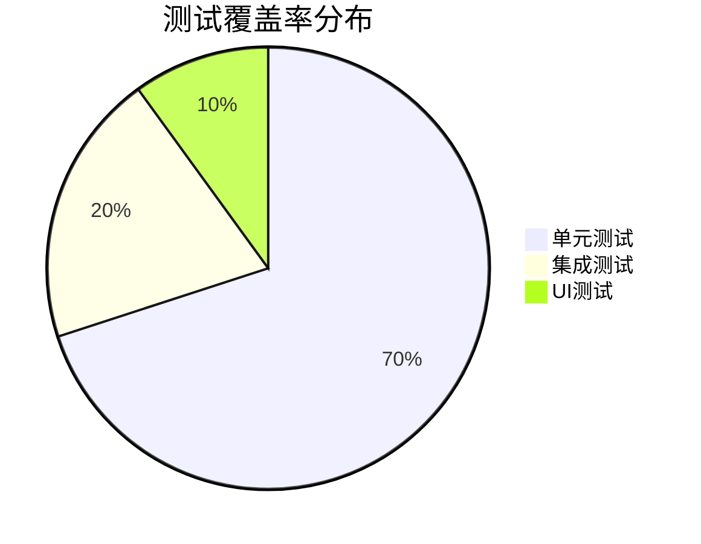
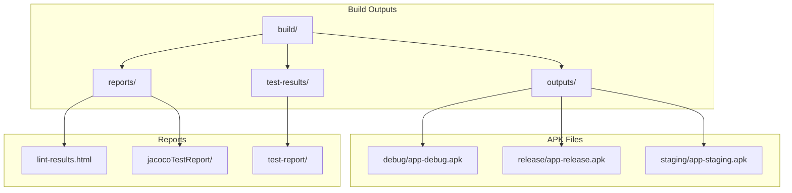
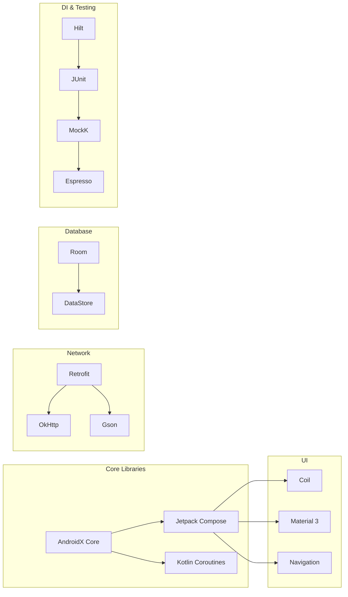
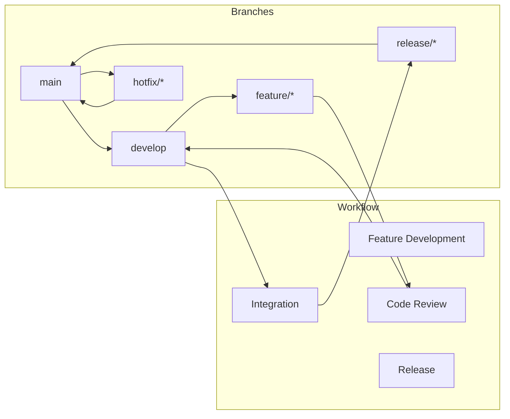

# GitHub Android App - 项目结构图

## 1. 整体项目结构

### 1.1 目录结构树形图
```
Github/
├── 📁 .gradle/
│   ├── 8.2/
│   ├── buildOutputCleanup/
│   └── vcs-1/
├── 📁 .idea/
│   ├── AndroidProjectSystem.xml
│   ├── gradle.xml
│   ├── misc.xml
│   └── workspace.xml
├── 📁 app/
│   ├── 📁 src/
│   │   ├── 📁 main/
│   │   │   ├── 📁 java/com/github/app/
│   │   │   │   ├── 📁 data/
│   │   │   │   │   ├── 📁 model/
│   │   │   │   │   ├── 📁 remote/
│   │   │   │   │   ├── 📁 repository/
│   │   │   │   │   └── 📁 local/
│   │   │   │   ├── 📁 domain/
│   │   │   │   │   ├── 📁 model/
│   │   │   │   │   ├── 📁 repository/
│   │   │   │   │   └── 📁 usecase/
│   │   │   │   ├── 📁 presentation/
│   │   │   │   │   ├── 📁 component/
│   │   │   │   │   ├── 📁 navigation/
│   │   │   │   │   ├── 📁 screen/
│   │   │   │   │   ├── 📁 theme/
│   │   │   │   │   └── 📁 viewmodel/
│   │   │   │   ├── 📁 di/
│   │   │   │   └── GitHubApplication.kt
│   │   │   ├── 📁 res/
│   │   │   │   ├── 📁 drawable/
│   │   │   │   ├── 📁 values/
│   │   │   │   └── 📁 xml/
│   │   │   └── AndroidManifest.xml
│   │   ├── 📁 test/
│   │   └── 📁 androidTest/
│   ├── build.gradle.kts
│   └── proguard-rules.pro
├── 📁 doc/
│   ├── 需求文档.md
│   ├── uml-class-diagram.md
│   ├── uml-sequence-diagram.md
│   └── uml-component-deployment.md
├── 📁 gradle/
│   └── 📁 wrapper/
├── 📁 build/
├── build.gradle.kts
├── settings.gradle.kts
├── gradle.properties
├── local.properties
└── README.md
```

### 1.2 模块结构可视化


## 2. 代码结构详细分析

### 2.1 数据层结构


### 2.2 领域层结构


### 2.3 表示层结构


## 3. 配置文件结构

### 3.1 Gradle配置结构
```mermaid
graph TD
    subgraph Build Configuration
        A[build.gradle.kts (Project)]
        B[build.gradle.kts (App)]
        C[settings.gradle.kts]
        D[gradle.properties]
        E[local.properties]
    end
    
    subgraph Dependencies
        F[Jetpack Compose]
        G[Hilt]
        H[Retrofit]
        I[Room]
        J[Coil]
        K[Testing Libraries]
    end
    
    subgraph Build Types
        L[Debug]
        M[Release]
        N[Staging]
    end
    
    A --> B
    C --> B
    D --> B
    E --> B
    
    B --> F
    B --> G
    B --> H
    B --> I
    B --> J
    B --> K
    
    B --> L
    B --> M
    B --> N
```

### 3.2 清单文件结构


## 4. 测试结构

### 4.1 测试目录结构


### 4.2 测试覆盖率


## 5. 构建输出结构

### 5.1 构建产物


## 6. 依赖管理结构

### 6.1 第三方库依赖


## 7. 版本控制结构

### 7.1 Git分支策略


---

**总结**: 本项目采用清晰的分层架构，遵循Clean Architecture原则，将代码分为数据层、领域层和表示层。每个层次都有明确的职责和边界，便于维护和测试。