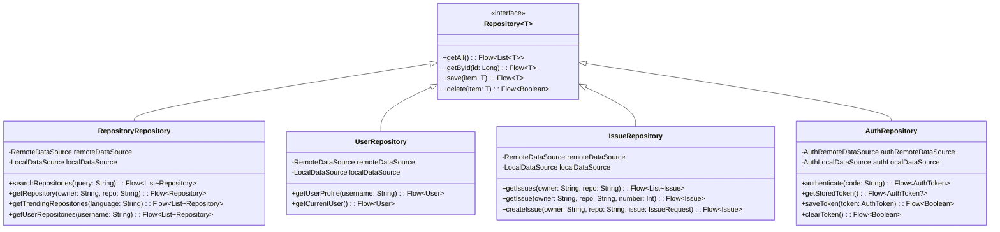

# GitHub Android App - UML类图详细设计

## 1. 整体架构类图

### 1.1 MVVM架构类图


## 2. 数据层类图

### 2.1 仓库模式类图


### 2.2 数据源类图


## 3. 领域层类图

### 3.1 用例类图
```mermaid
classDiagram
    class UseCase~Input, Output~ {
        <<interface>>
        +execute(input: Input): Flow~Output~
    }
    
    class GetRepositoriesUseCase {
        -RepositoryRepository repository
        +execute(page: Int): Flow~List~Repository~~
    }
    
    class SearchRepositoriesUseCase {
        -RepositoryRepository repository
        +execute(query: String): Flow~List~Repository~~
    }
    
    class GetTrendingRepositoriesUseCase {
        -RepositoryRepository repository
        +execute(language: String): Flow~List~Repository~~
    }
    
    class GetUserProfileUseCase {
        -UserRepository userRepository
        +execute(username: String): Flow~User~
    }
    
    class GetUserRepositoriesUseCase {
        -RepositoryRepository repository
        +execute(username: String): Flow~List~Repository~~
    }
    
    class GetIssuesUseCase {
        -IssueRepository issueRepository
        +execute(owner: String, repo: String): Flow~List~Issue~~
    }
    
    class CreateIssueUseCase {
        -IssueRepository issueRepository
        +execute(request: IssueRequest): Flow~Issue~
    }
    
    UseCase~Int, List~Repository~~ <|-- GetRepositoriesUseCase
    UseCase~String, List~Repository~~ <|-- SearchRepositoriesUseCase
    UseCase~String, List~Repository~~ <|-- GetTrendingRepositoriesUseCase
    UseCase~String, User~ <|-- GetUserProfileUseCase
    UseCase~String, List~Repository~~ <|-- GetUserRepositoriesUseCase
    UseCase~IssueRequest, Issue~ <|-- CreateIssueUseCase
```

### 3.2 实体类图


## 4. 表示层类图

### 4.1 UI组件类图


### 4.2 导航类图


## 5. 依赖注入类图

### 5.1 Hilt模块类图


## 6. 错误处理类图

### 6.1 异常处理类图


## 7. 状态管理类图

### 7.1 UI状态类图


## 8. 网络层类图

### 8.1 API客户端类图


---

**注意**: 所有类图使用Mermaid语法绘制，可以在支持Mermaid的工具中直接渲染查看。