# GitHub Android App - 组件图与部署图

## 1. 系统组件架构图

### 1.1 整体组件结构
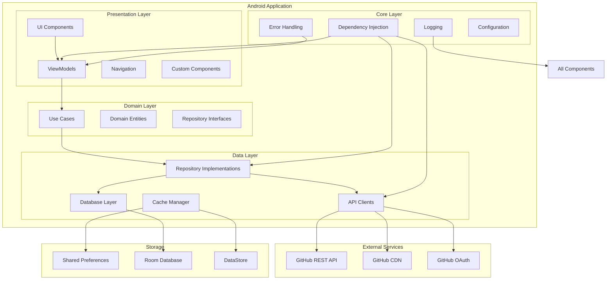

### 1.2 模块依赖关系图
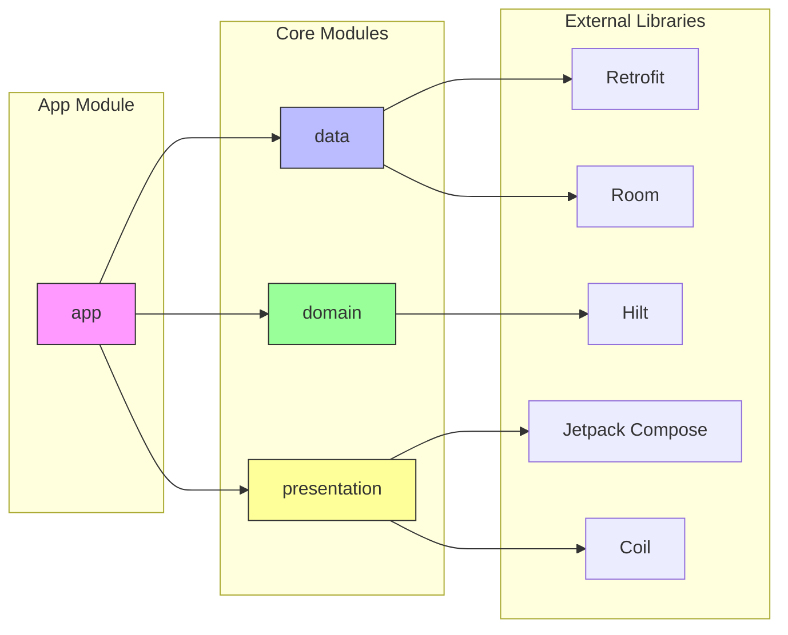

## 2. 部署架构图

### 2.1 客户端部署架构
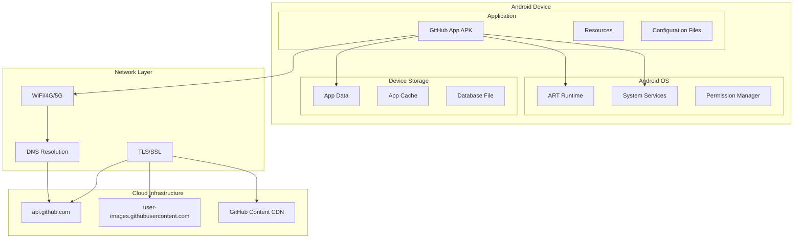

### 2.2 网络架构图
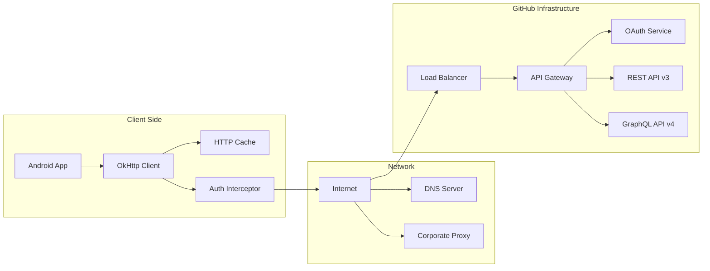

## 3. 运行时架构图

### 3.1 进程架构
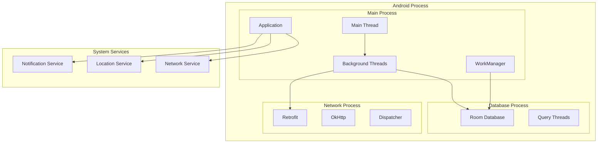

### 3.2 内存架构
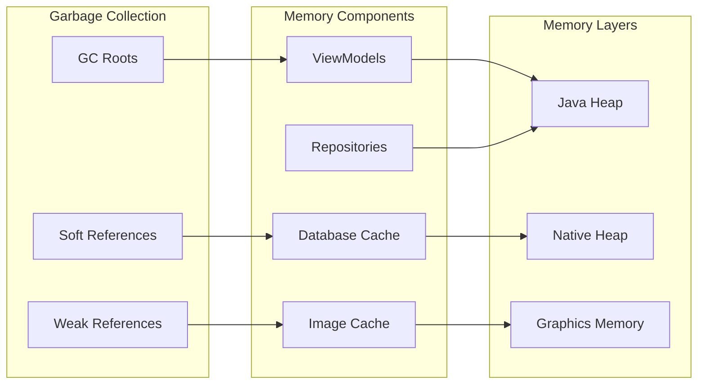

## 4. 安全架构图

### 4.1 认证架构
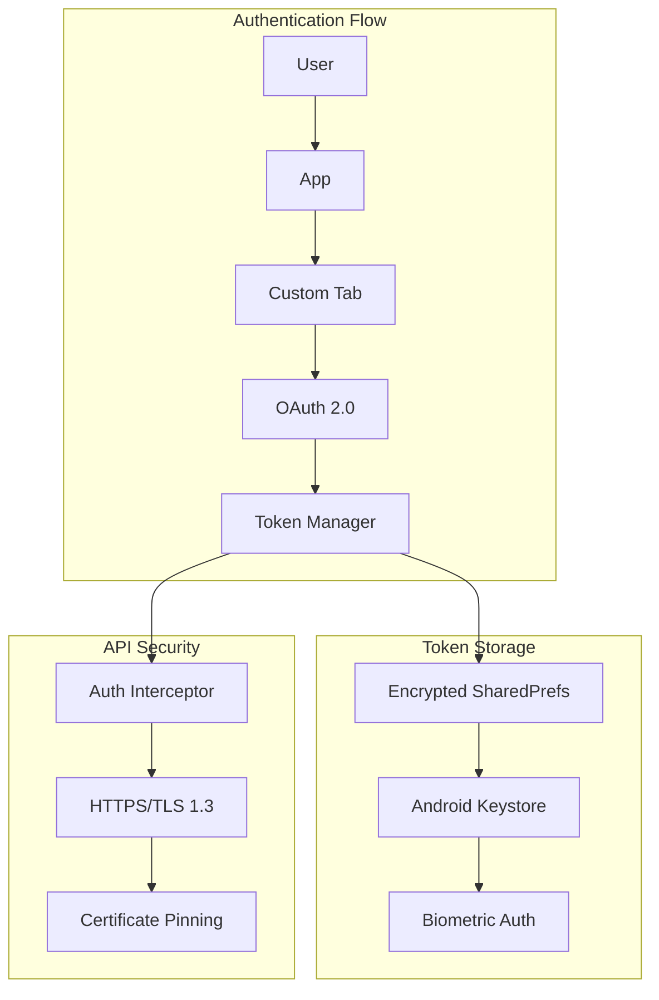

### 4.2 数据保护架构
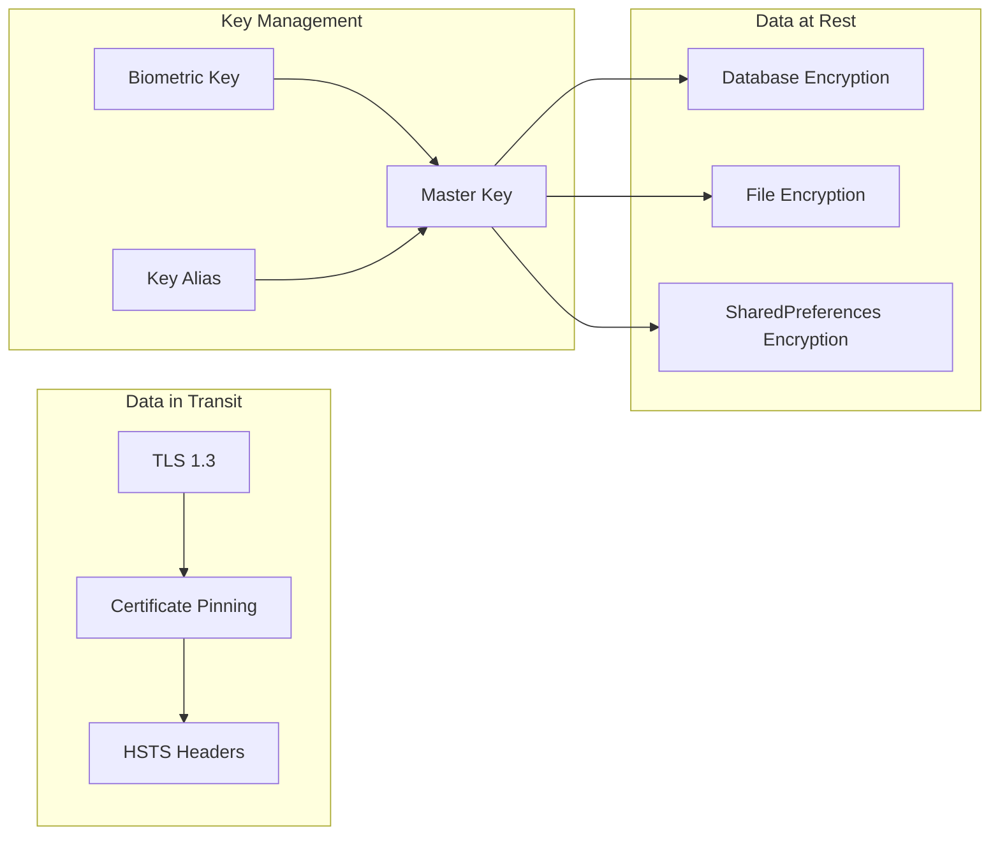

## 5. 性能架构图

### 5.1 缓存架构
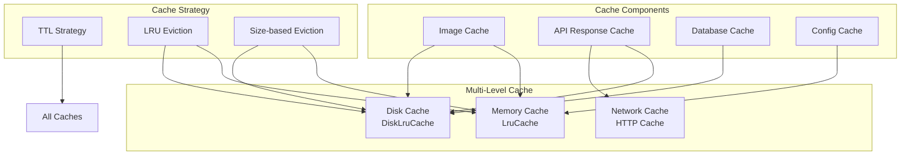

### 5.2 并发架构
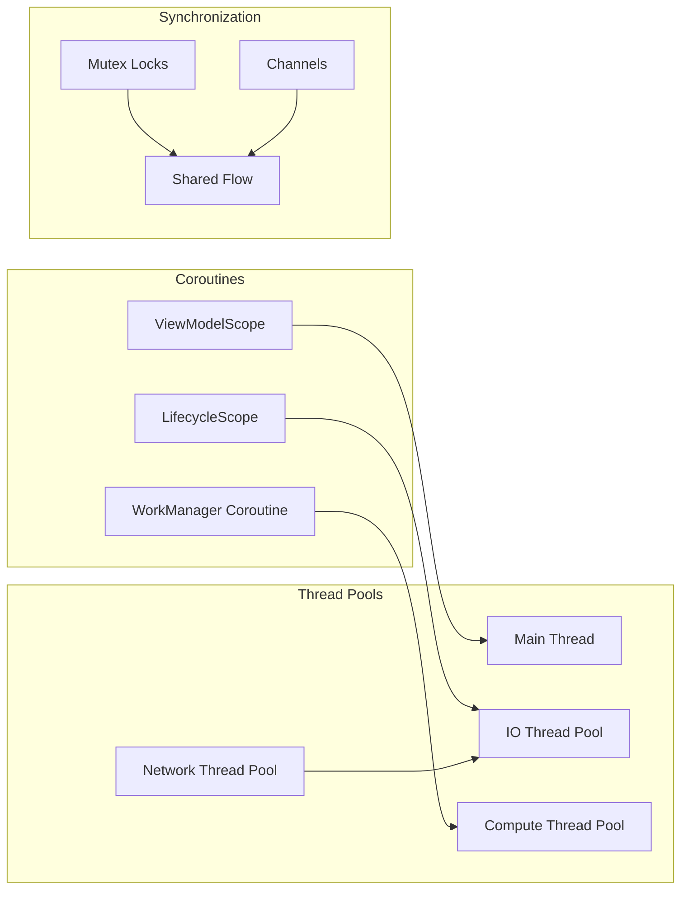

## 6. 监控架构图

### 6.1 应用监控
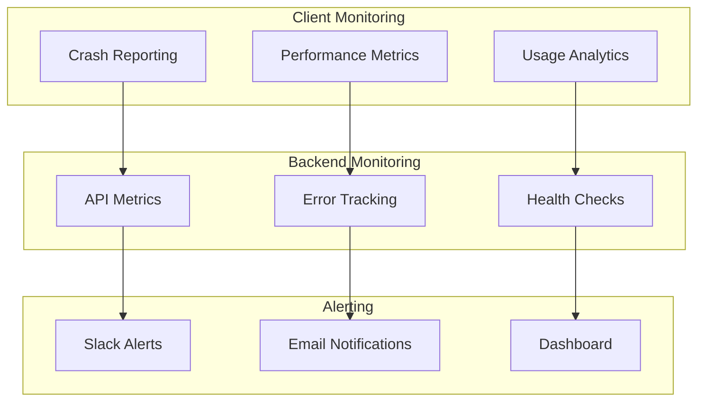

### 6.2 日志架构
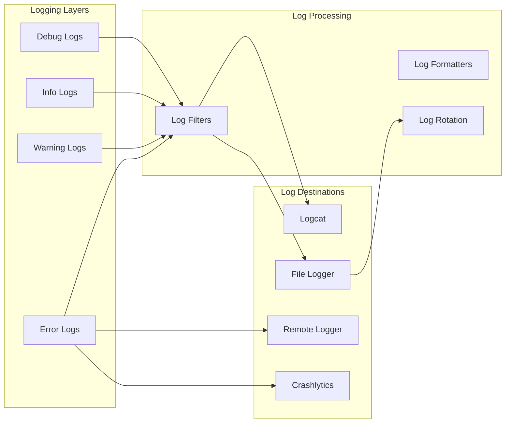

## 7. 测试架构图

### 7.1 测试金字塔架构
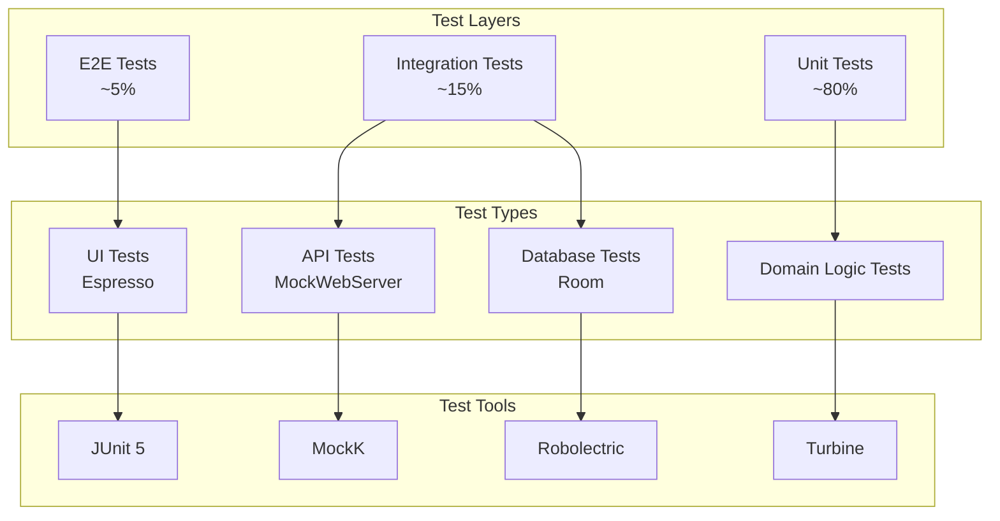

### 7.2 CI/CD架构
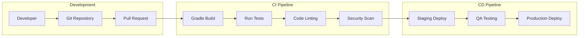

## 8. 国际化架构图

### 8.1 本地化架构
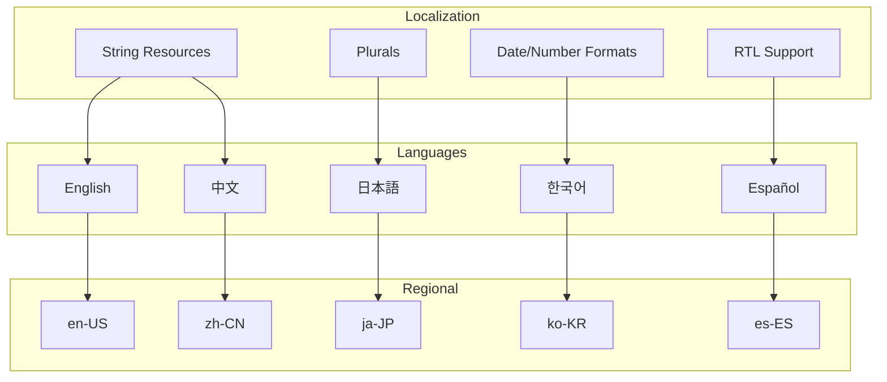

---

**总结**: 这些组件图和部署图展示了GitHub Android App的完整技术架构，包括客户端架构、网络架构、安全架构、性能架构和部署架构。这些图表为开发团队提供了系统设计的全面视图。