# GitHub Android App - UML序列图详细设计

## 1. 用户认证序列图

### 1.1 GitHub OAuth认证流程
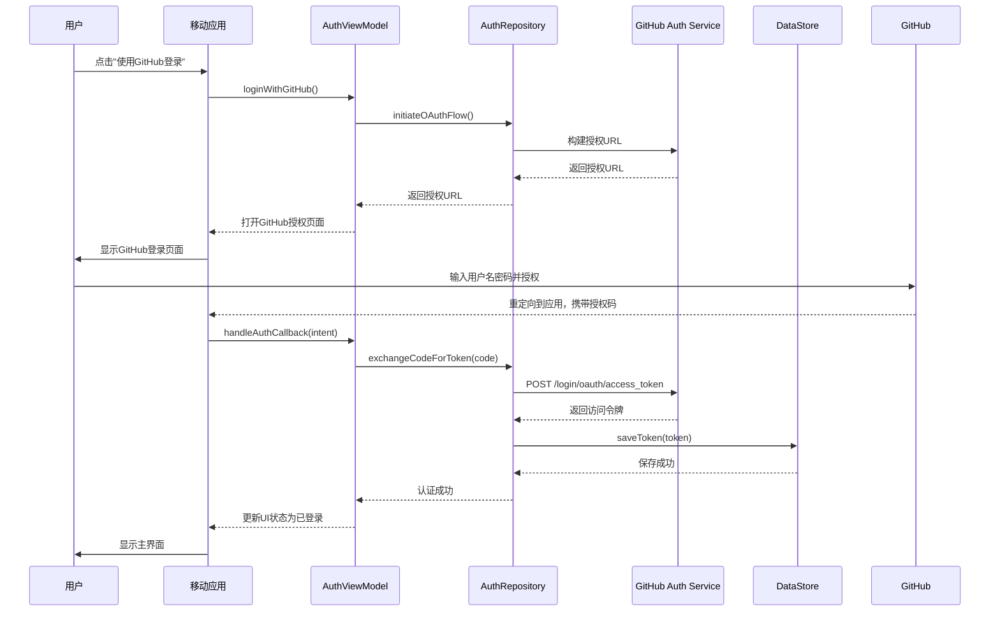

### 1.2 自动登录流程
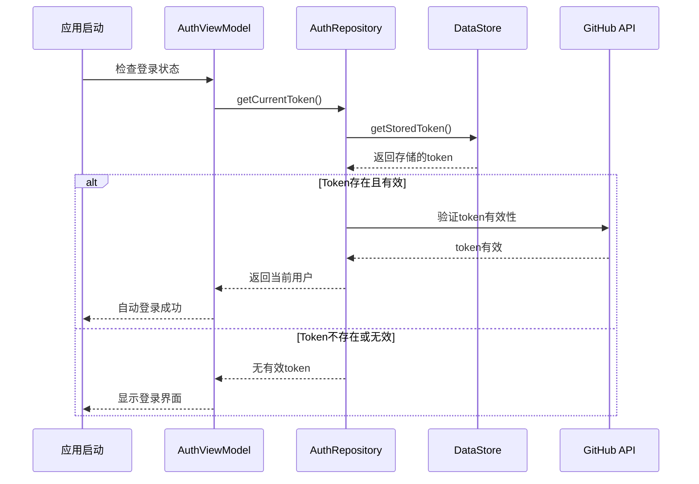

## 2. 仓库浏览序列图

### 2.1 搜索仓库流程
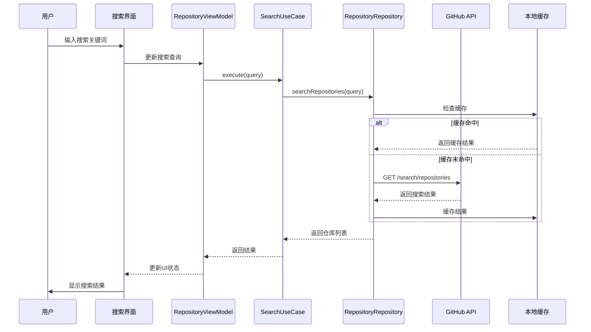

### 2.2 查看仓库详情流程
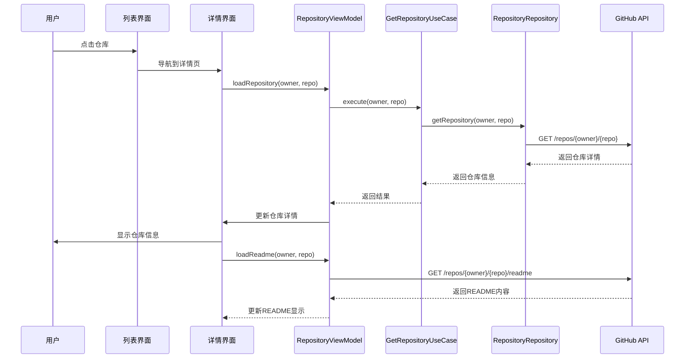

### 2.3 加载趋势仓库流程
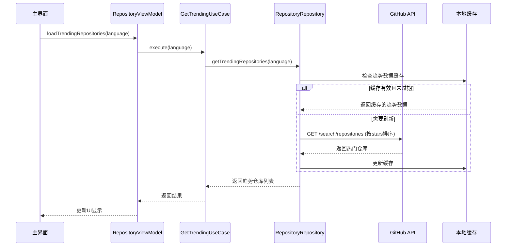

## 3. 用户资料浏览序列图

### 3.1 查看用户资料流程
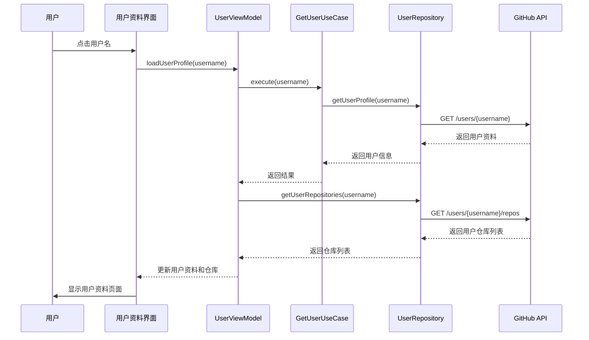

## 4. 问题管理序列图

### 4.1 查看仓库问题流程
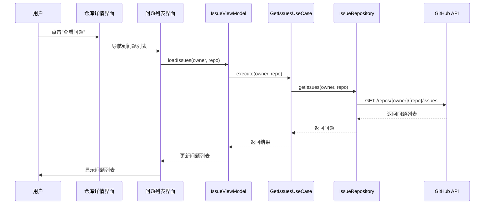

### 4.2 创建新问题流程
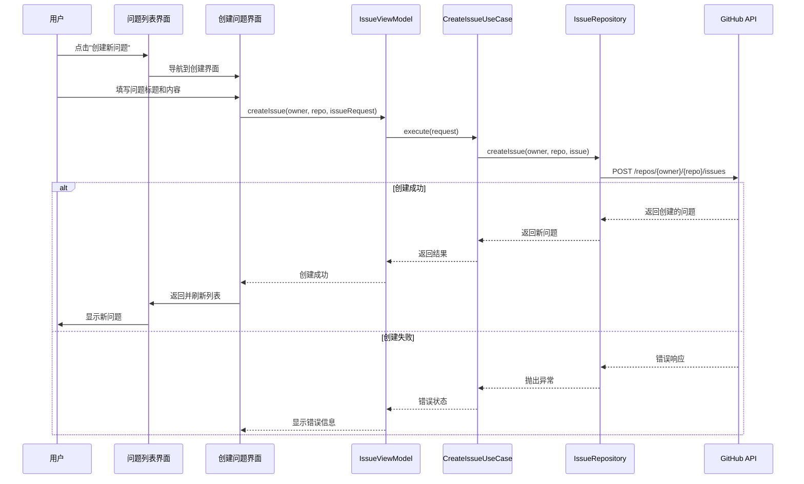

## 5. 数据同步序列图

### 5.1 下拉刷新流程
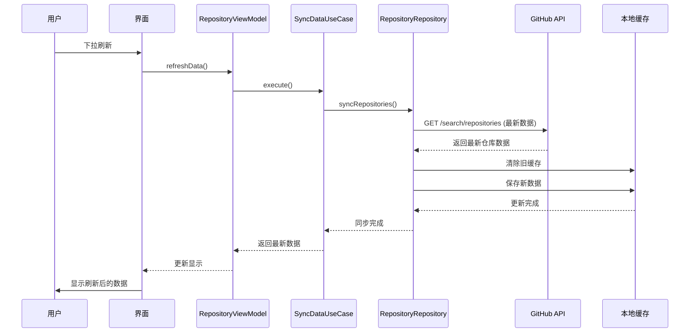

### 5.2 分页加载更多流程
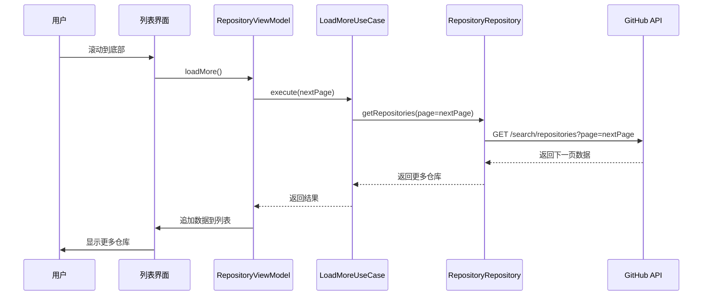

## 6. 错误处理序列图

### 6.1 网络错误处理
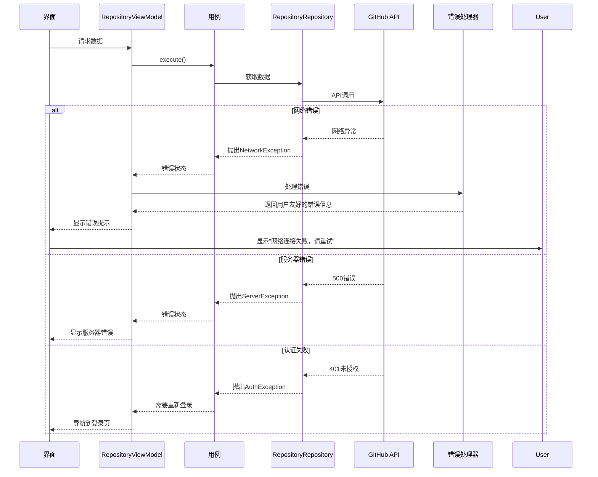

### 6.2 缓存失效处理
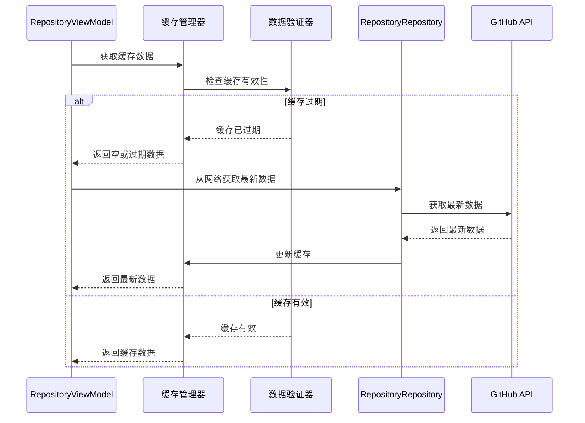

## 7. 数据验证序列图

### 7.1 搜索查询验证
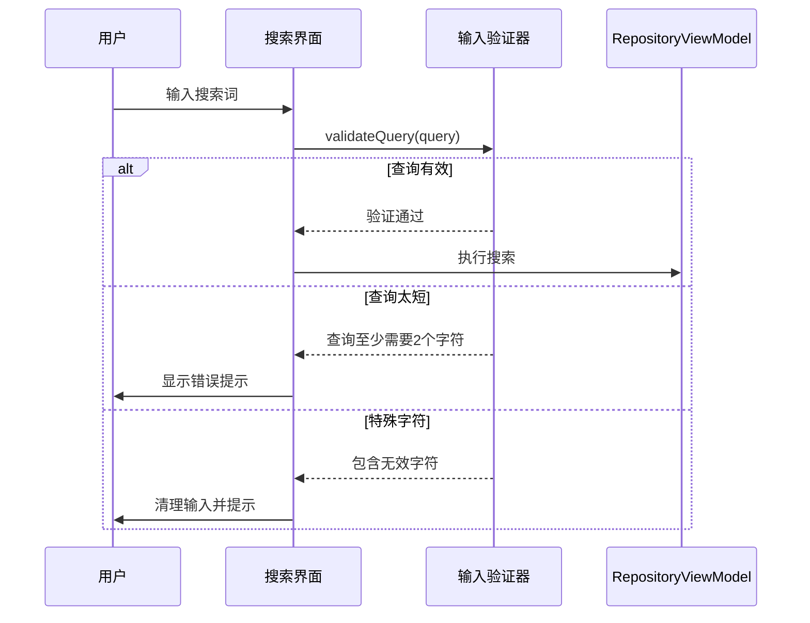

## 8. 性能优化序列图

### 8.1 图片加载优化
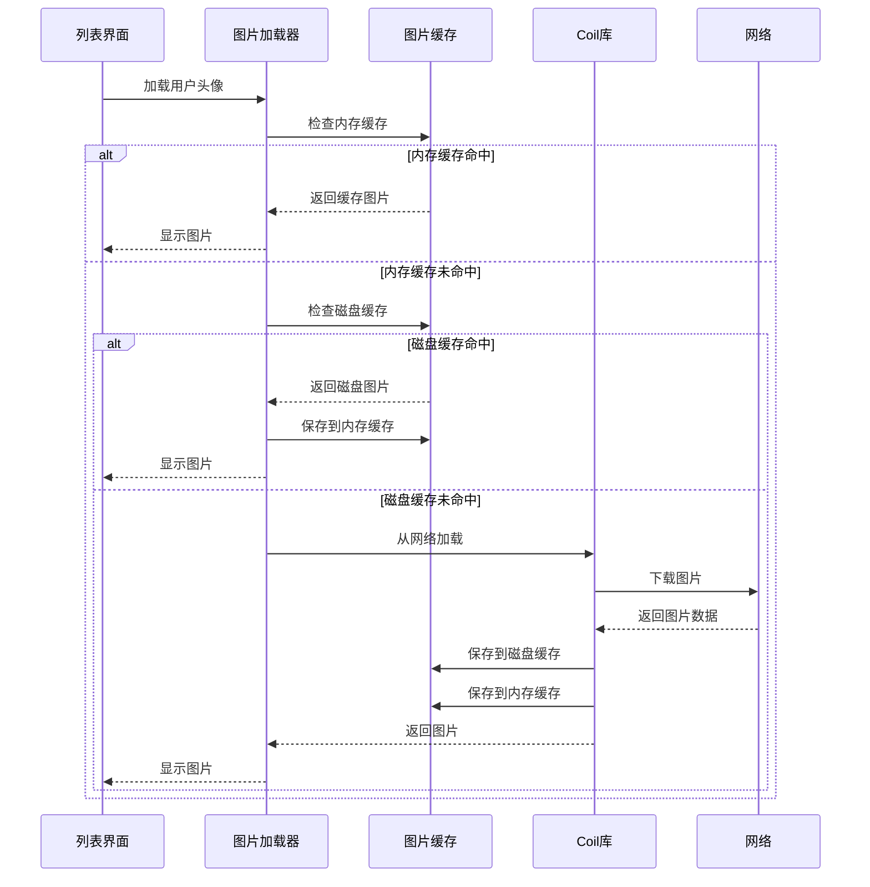

### 8.2 数据预加载
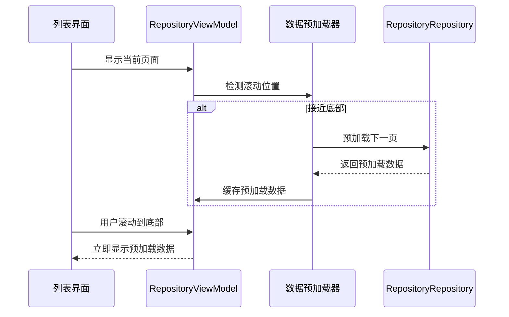

---

**说明**: 所有序列图使用Mermaid语法，描述了应用的核心交互流程和错误处理机制。