# GitHub Android App 需求文档

## 1. 项目概述

GitHub Android App是一个现代化的Android应用程序，专为浏览GitHub仓库而设计。该应用采用最新的Android开发技术栈，包括Jetpack Compose、Hilt依赖注入、MVVM架构模式等。

## 2. 功能需求

### 2.1 核心功能

#### 2.1.1 仓库搜索与浏览
- **仓库搜索**: 支持按关键词、语言、星标数等条件搜索GitHub仓库
- **趋势仓库**: 显示按编程语言分类的热门仓库
- **仓库详情**: 展示仓库的详细信息，包括README、文件结构、提交历史等

#### 2.1.2 用户管理
- **用户认证**: 通过GitHub OAuth进行安全登录
- **用户资料**: 查看用户详细信息、仓库列表、关注者等
- **个人收藏**: 收藏和管理喜欢的仓库

#### 2.1.3 问题管理
- **问题浏览**: 查看仓库的问题列表
- **问题详情**: 查看问题的详细信息和讨论
- **创建问题**: 为仓库创建新的问题

#### 2.1.4 通知与更新
- **实时通知**: 接收仓库更新、问题回复等通知
- **离线缓存**: 支持离线浏览已访问的内容

### 2.2 非功能性需求

#### 2.2.1 性能要求
- 应用启动时间 < 2秒
- 页面加载时间 < 1秒
- 支持离线浏览缓存数据
- 图片懒加载和缓存

#### 2.2.2 用户体验
- Material Design 3设计规范
- 响应式设计，支持手机和平板
- 深色/浅色主题切换
- 流畅的动画过渡效果

#### 2.2.3 安全性
- 安全的OAuth 2.0认证
- HTTPS网络通信
- 敏感数据加密存储

## 3. 系统架构

### 3.1 整体架构图

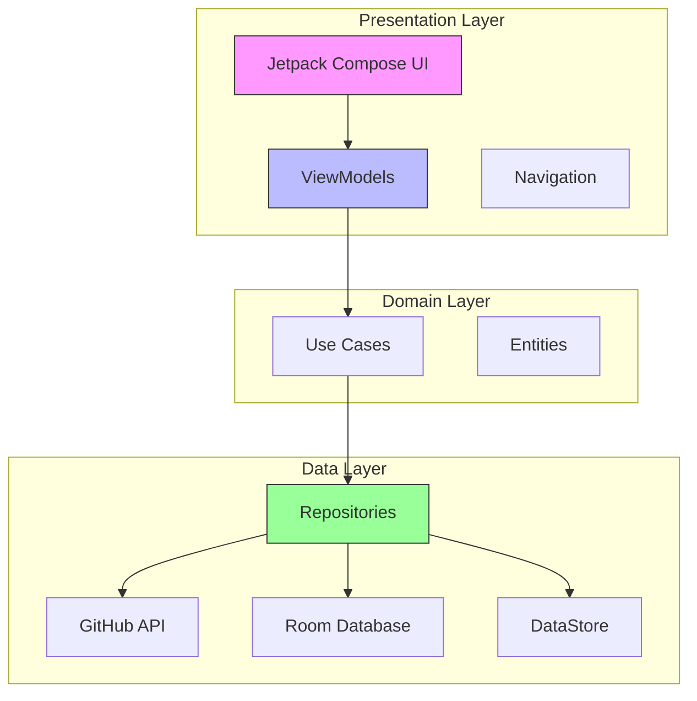

### 3.2 技术架构

#### 3.2.1 表示层 (Presentation Layer)
- **Jetpack Compose**: 现代声明式UI框架
- **ViewModel**: 管理UI状态和业务逻辑
- **Navigation**: 类型安全的导航组件
- **Hilt**: 依赖注入框架

#### 3.2.2 领域层 (Domain Layer)
- **Use Cases**: 业务逻辑封装
- **Entities**: 核心业务模型
- **Repository Interfaces**: 数据访问抽象

#### 3.2.3 数据层 (Data Layer)
- **Repository Implementations**: 数据仓库实现
- **Remote Data Source**: GitHub REST API客户端
- **Local Data Source**: Room数据库和DataStore
- **Network**: Retrofit + OkHttp网络层

## 4. 数据模型设计

### 4.1 核心数据模型

#### 4.1.1 仓库模型 (Repository)
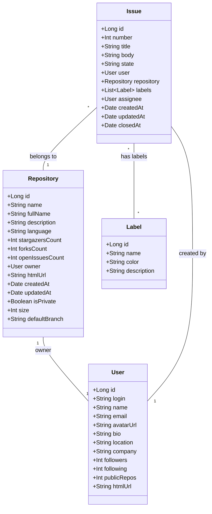

#### 4.1.2 用户认证模型
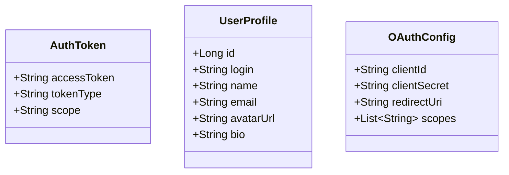

### 4.2 数据库设计

#### 4.2.1 Room数据库实体关系图
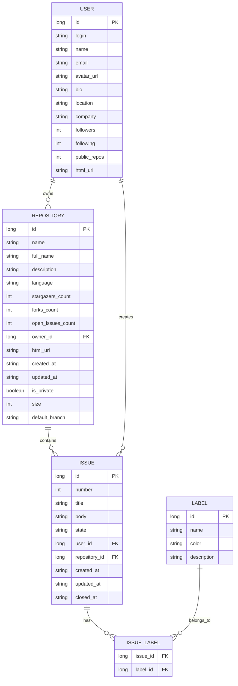

## 5. 用户界面设计

### 5.1 主要界面流程图

#### 5.1.1 用户认证流程
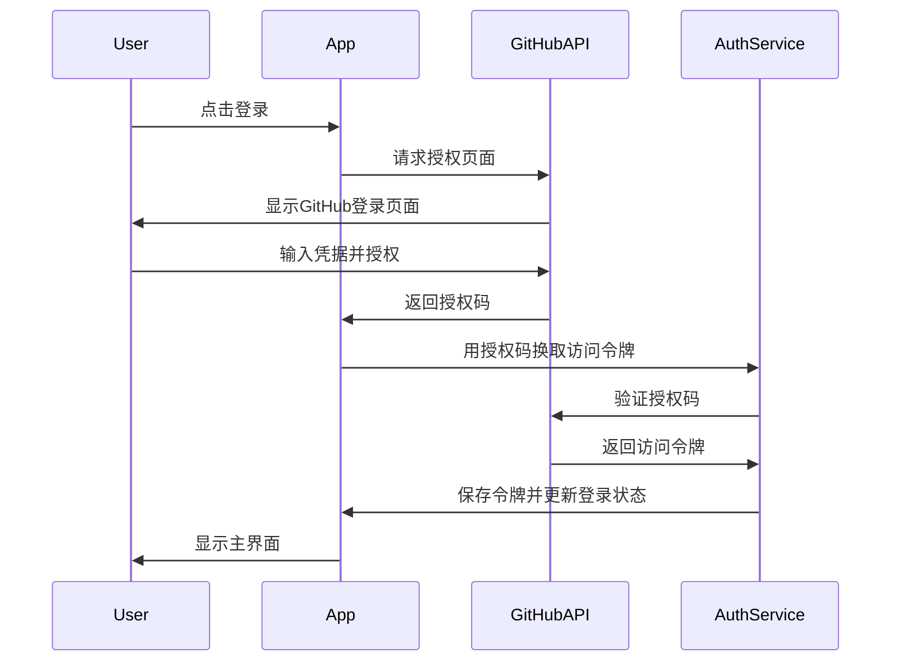

#### 5.1.2 仓库浏览流程
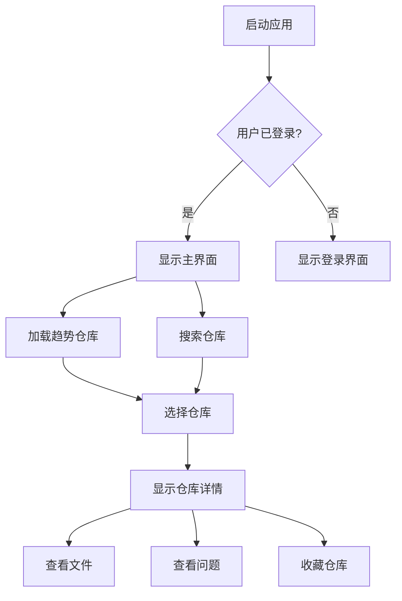

### 5.2 界面原型设计

#### 5.2.1 主界面布局
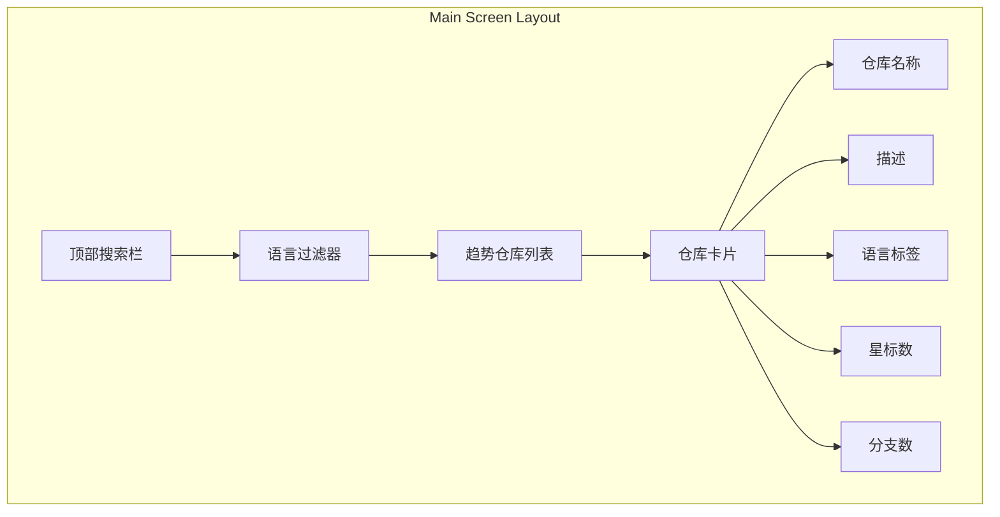

#### 5.2.2 仓库详情页
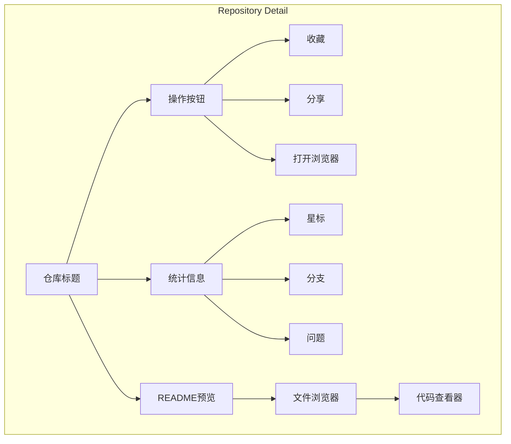

## 6. API设计

### 6.1 REST API接口设计

#### 6.1.1 认证相关API
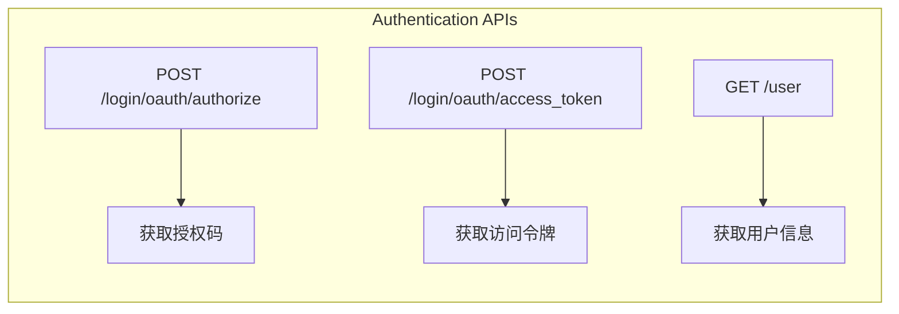

#### 6.1.2 仓库相关API
```mermaid
graph LR
    subgraph Repository APIs
        A[GET /search/repositories] --> B[搜索仓库]
        C[GET /repositories/{id}] --> D[获取仓库详情]
        E[GET /repos/{owner}/{repo}/readme] --> F[获取README]
        G[GET /repos/{owner}/{repo}/issues] --> H[获取问题列表]
    end
```

### 6.2 数据流图
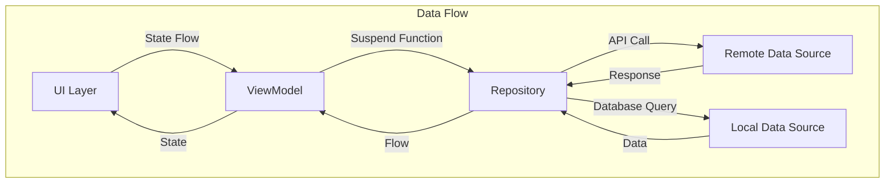

## 7. 测试策略

### 7.1 测试金字塔
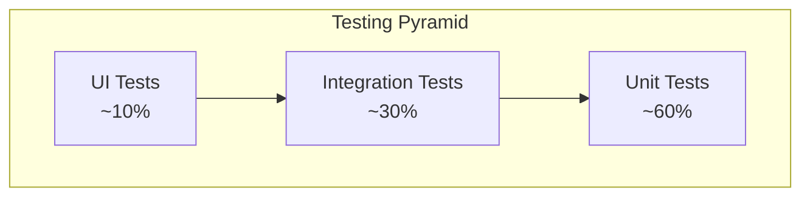

### 7.2 测试覆盖范围
- **单元测试**: ViewModels、Repositories、Use Cases
- **集成测试**: API调用、数据库操作
- **UI测试**: 用户界面交互、导航流程
- **端到端测试**: 完整用户场景测试

## 8. 部署与发布

### 8.1 构建配置
- **Debug版本**: 开发调试，包含调试信息
- **Release版本**: 生产发布，代码混淆和优化

### 8.2 发布流程
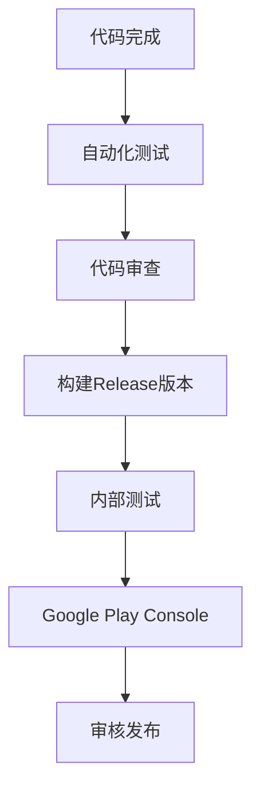

## 9. 安全考虑

### 9.1 数据安全
- OAuth 2.0安全认证
- HTTPS网络通信
- 敏感数据加密存储
- 令牌自动刷新机制

### 9.2 隐私保护
- 最小权限原则
- 用户数据匿名化
- 符合GDPR规范

## 10. 性能优化

### 10.1 性能指标
- 启动时间 < 2秒
- 页面加载时间 < 1秒
- 内存使用优化
- 电池消耗最小化

### 10.2 优化策略
- 图片懒加载和缓存
- 数据分页加载
- 网络请求合并
- 数据库查询优化

## 11. 监控与分析

### 11.1 应用性能监控
- 崩溃率监控
- 性能指标收集
- 用户行为分析

### 11.2 日志策略
- 分级日志记录
- 敏感信息脱敏
- 错误追踪和分析

---

**文档版本**: 1.0.0  
**最后更新**: 2024年  
**状态**: 活跃开发中